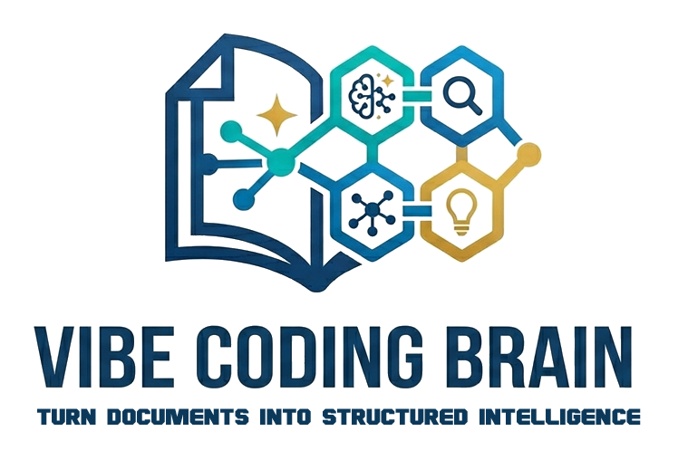
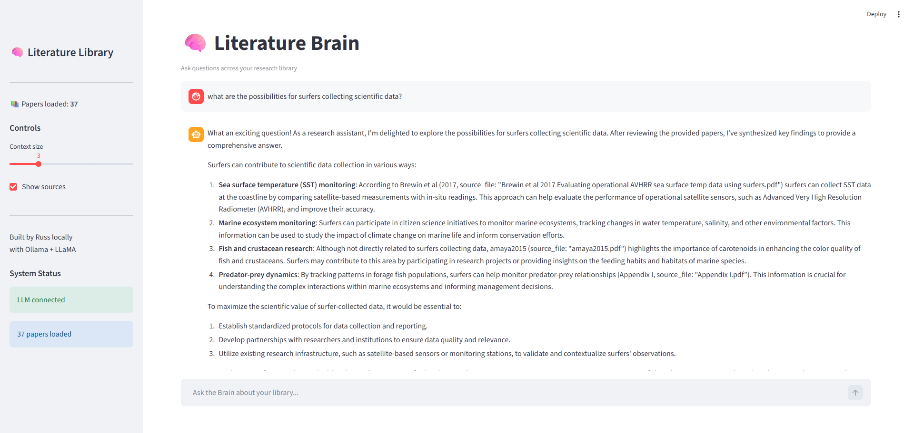

  

> Turn documents into structured intelligence.

# 🧠 Literature Brain

> A local AI-powered research assistant that turns documents into structured, searchable knowledge.

---

## 🚀 Features

- 📄 Process PDFs, DOCX, XLSX, PPTX
- 🧠 Extract structured insights using local LLMs
- 🔍 Query across your entire document library
- 💬 Chat-style interface (Streamlit)
- ⚡ Fully local — no cloud required

---

## 🖼️ Demo

### App Interface

### Example Query

---

## 🧩 How It Works

data/ → process_paper.py → Ollama (LLaMA 3) → outputs/*.json → brain.py → Streamlit UI

---

## ⚙️ Setup

### 1. Install dependencies

pip install -r requirements.txt

### 2. Install Ollama
https://ollama.com

### 3. Pull model

ollama pull llama3

### 4. Run the app

python -m streamlit run app.py

---

## 📁 Project Structure

vibe-coding/ 
├── app.py # Streamlit UI 
├── brain.py # Query engine 
├── process_paper.py # Data ingestion pipeline 
├── outputs/ # Structured JSON 
├── data/ # Source documents

---

## 🧠 Future Improvements

- 🔎 Semantic search (embeddings)
- 📊 Tag filtering UI
- 📄 Document viewer
- ⚡ Streaming responses
- 🧾 Inline citations

---

## 🤝 Contributing

Pull requests welcome. For major changes, open an issue first.

---

## 📜 License

MIT
